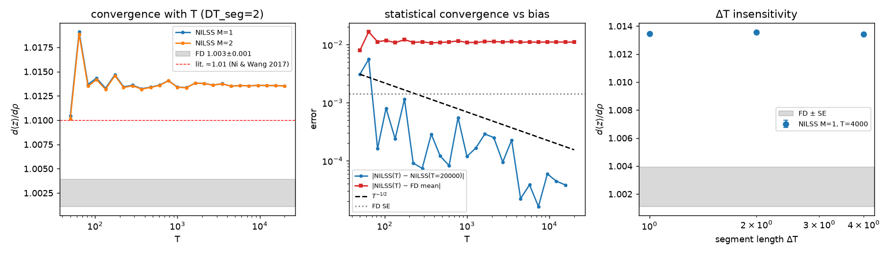
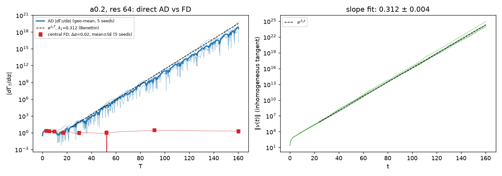
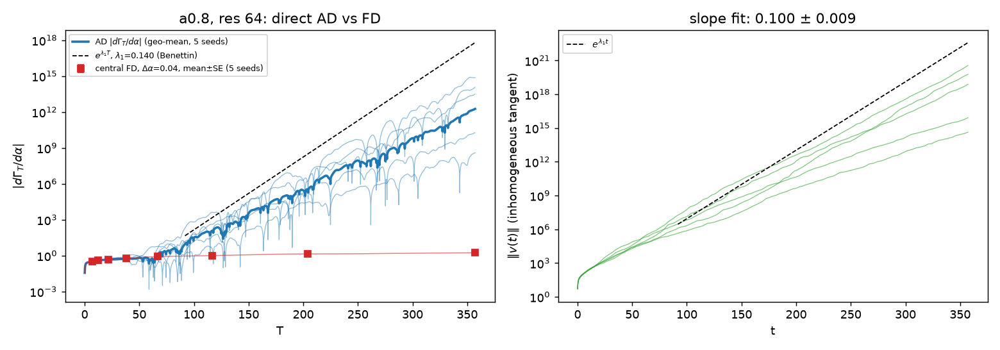
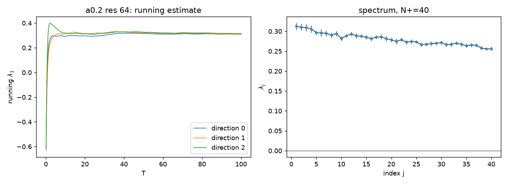
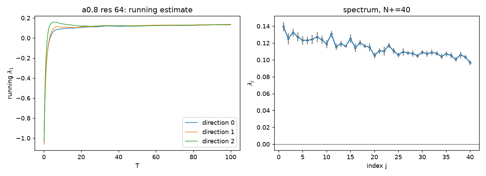

# Sensitivity of MHW turbulent flux: direct AD failure, Lyapunov spectrum, NILSS

All numbers in this document were produced in this session on a 4-core CPU
container (no GPU), JAX 0.10.2, float64 everywhere
(`jax.config.update("jax_enable_x64", True)`).  Every script under
`experiments/` reproduces its figure from the command line with fixed seeds;
spun-up states are cached under `results/sens/states/` (git-ignored, regenerated
on demand).  Raw numbers are in `results/sens/*.json`.

Conventions used throughout:

* state `u = (w, n)` on the periodic 64 x 64 box, `w = nabla^2 phi`; the sensitivity
  code works in real space, `step = ifft2 o step_rk4 o fft2` of the archived
  solver (`sens/mhw_system.py`);
* quantity of interest `Gamma = < -kappa n d_y phi >` (domain mean, archive
  convention; positive = outward, kappa = 1 so it equals `< -n d_y phi >`);
* differentiated parameter `s = alpha` (adiabaticity), kappa held fixed, matching
  `mhw_jax_stage2_ad.run_ad_window`;
* every tangent is `jax.jvp(step, (u, s), (v, ds))` of the same discrete map the
  primal uses; forward mode only; no hand-written tangent equations;
* "t.u." = simulation time unit; dt = 0.0025 unless stated.

---

## 0. What was in the repo, and two things that had to change before any task could start

### 0.1 Interfaces found

| item | where | interface |
|---|---|---|
| step | `mhw_jax_stage2_ad.step_rk4(state, (grid, (alpha, kappa)))` | state = `(w_hat, n_hat)` complex spectral; RK4 on advection + coupling + kappa drive, then exact damping `exp(-nu k^diffop dt)` |
| params | `MHWParams(nx, ny, Lx=64, Ly=64, alpha, kappa, diffw, diffn, diffop, dt)` + `get_jax_params` | wavenumbers, `inv_ksq`, damping factors |
| flux | inline in `run_ad_window` | `mean(-kappa * n * d_y phi)`, evaluated after each step |
| AD-vs-FD experiment | `results/stage1`, `results/stage2`, `results/summary/tables` | FD at 256^2, T = 1000, alpha = 0.2 +/- 0.02 and 0.8 +/- 0.02 (`dGamma/dalpha = +0.086`, `-0.0107`); reverse-mode AD at 64^2, 10 000 steps (T = 25), 20 seeds each (`-4.8e-5`, `-2.0e-6`) |
| two regimes | same tables | alpha = 0.2 and alpha = 0.8; kappa = 1, nu_w = nu_n = 1e-3, diffop = 6 (k^6), dt = 0.0025, box 64 x 64, RK4, Arakawa, modified HW |
| tangent solver | none | not in the repo |
| Lyapunov estimator | none | not in the repo |

The brief assumed a tangent solver and a Lyapunov estimator exist.  They do not;
both were written here (`sens/lyapunov.py`, `sens/nilss.py`) on top of the
archived `step_rk4`.

### 0.2 The archived Arakawa bracket is wrong (fixed)

Running the archived 64^2 regimes past the archived 10 000-step AD window, every
run went non-finite at t ~ 100 (both alphas; also with dt/2, 10x nu, the centered
bracket, unmodified HW; the archived 128^2 run also died at t ~ 477 per
`run_notes.txt`).  Energy piled up in zonal density and then at the grid scale.
Testing the operators individually against an analytic Jacobian
(`experiments/`-independent check reproduced in the commit message) showed that
the `J^{x+}` term (`j3`) of `arakawa` has two sign errors:

```
archived:  j3 = f5*(g3 - g1) - f6*(g4 - g2) - f7*(g4 - g1) + f8*(g3 - g2)
correct:   j3 = f5*(g3 - g1) - f6*(g2 - g4) - f8*(g3 - g2) + f7*(g1 - g4)
```

| grid | rel. error of archived bracket | rel. error of fixed bracket |
|---|---|---|
| 64^2 | 0.64 | 2.6e-2 |
| 128^2 | 1.28 | 6.5e-3 |
| 256^2 | 2.53 | 1.6e-3 |

The archived operator is exactly antisymmetric (sum f J = sum g J = 0 to 1e-14), which
is why the 256^2 production runs did not blow up: they conserved energy and
enstrophy of the wrong advection.  It is *not* a consistent approximation of the
Jacobian (error grows with resolution).  **Every archived number (the FD values
+0.086 / -0.0107, the direct-AD numbers, the ensemble study) was produced with
this operator and is not a property of the HW/MHW equations.**

The fix is in `mhw_jax_stage2_ad.arakawa` (the archived version is kept as
`arakawa_archived` for provenance); `mhw_jax.py` is untouched except for a
warning in the docstring so that the historical logs stay reproducible.  With the
fix, the 64^2 archive regimes saturate (alpha = 0.2: E ~ 12, Gamma ~ 2.2 after
t ~ 115; alpha = 0.8: E ~ 4, Gamma ~ 0.45 after t ~ 140) and are chaotic
(Section 2).  All results below use the fixed operator and otherwise the archive
parameters (kappa = 1, nu = 1e-3, k^6, dt = 0.0025, box 64) at 64^2, except where
a regime change is stated explicitly (Task 4).

### 0.3 Compute budget

| grid | primal step | + 1 jvp tangent | per extra vmapped tangent |
|---|---|---|---|
| 32^2 | 0.21 ms | 0.60 ms | ~0.3 ms |
| 64^2 | 1.09 ms | 2.77 ms | ~1.1 ms |
| 128^2 | 4.35 ms | 8.66 ms | ~4.2 ms |

256^2 for T = 1000 (the archive's FD protocol) is ~2 h per run here and was not
attempted; the archive's own 256^2 runs took 1.6 h each on NERSC.

---

## 3. NILSS on Lorenz 63  (done first because it gates everything else)

`sens/nilss.py` implements Ni & Wang (2017) as described in its module
docstring; the authors' prototype (`github.com/niangxiu/nilss`) was used to
cross-check every formula (the paper itself is not reachable from this
container: arXiv and ScienceDirect are blocked by the egress proxy, so equation
numbers are not quoted).  Per segment: `M` homogeneous tangents and one
inhomogeneous tangent by `jax.jvp` of the RK4 step (vmapped over M+1), projected
orthogonally to the neutral direction `f` at every step to form
`C_i = int W_perp^T W_perp dt`, `d_i = int W_perp^T v*_perp dt`; at the boundary
`W_perp = Q R`, `b = Q^T v*_perp`, restart `W <- Q`, `v* <- v*_perp - Q b`;
constrained least squares `min sum a_i^T C_i a_i + 2 d_i^T a_i` s.t.
`a_{i+1} = R_i a_i + b_i` by a sparse KKT solve; sensitivity assembled with the
time-dilation term.  Two algebraically equivalent assemblies are computed:
form A (`dJds_ibp`, integration by parts, identical to the authors' code) and form
B (`dJds`, discretely consistent: per-step `xi` differences).  They agree to
< 1e-3 at dt = 0.01 and converge together as dt -> 0 (Table 3b).

Settings: sigma = 10, beta = 8/3, rho = 28, J = z, s = rho, RK4 with dt = 0.01,
warm-up 200 t.u., 10 discarded warm-up segments, `v*(0) = 0`, `W(0)` random
orthonormal.

**A necessary implementation choice (found by the DT check failing).**  With the
discrete neutral direction `f = (u_{n+1} - u_n)/dt` the result depended on the
segment length (1.05 / 1.30 +/- 0.17 / 2.45 +/- 1.2 for DT = 1, 2, 4) and on dt.
That direction is neutral for the RK4 map only to O(dt^2) per step, whereas the
ODE right-hand side is neutral to O(dt^5); with `f = RHS` the dependence vanished
(table below).  All NILSS results in this document use `f = RHS` (for MHW: the
semi-discrete RHS `rhs_hw - nu k^6 (.)`, `MHWSystem.rhs`).

### Table 3: Lorenz 63, d<z>/drho  (`experiments/task3_nilss_lorenz.py`)

| estimate | value | settings |
|---|---|---|
| FD (central) | **1.0025 +/- 0.0014** | drho = 0.5, 20 independent trajectories x T = 20 000, SE over trajectories |
| NILSS, M = 1 | **1.0135** | DT = 2, T = 20 000 (K = 10 000 segments) |
| NILSS, M = 2 | 1.0135 | same (identical to 4 digits; the extra direction is stable) |
| NILSS scatter | 1.0137 +/- 0.0002 (std over 10 trajectories) | M = 1, DT = 2, T = 2000 each |
| DT = 1 / 2 / 4 | 1.0135 / 1.0136 / 1.0134 (+/- 1e-4) | M = 1, T = 4000, 4 trajectories each |
| literature | ~1.01 | Ni & Wang 2017 (value taken from the brief; the paper could not be opened here) |
| max \|v_perp\| | 1.9 (mean 0.65) | bounded over T = 20 000 |
| wall time | 9 s for T = 20 000 (M = 1) | |

Convergence with T (M = 1): 1.0104 (T = 50), 1.0143 (104), 1.0134 (222), 1.0134
(472), 1.0134 (998), 1.0138 (2114), 1.0135 (4472), 1.0136 (9456), 1.0135
(20 000).  The statistical error |NILSS(T) - NILSS(20 000)| falls faster than
T^{-1/2} (Fig. 3, middle), from 3e-3 at T = 50 to < 1e-4 by T ~ 5000.



### Table 3b: the 1 % gap is real  (`experiments/task3b_lorenz_checks.py`)

| check | result |
|---|---|
| FD, drho = 0.25 / 0.5 / 1.0 / 2.0 (20 x T = 20 000, dt = 0.01) | 1.0108 +/- 0.0033 / 1.0025 +/- 0.0014 / 1.0029 +/- 0.0010 / 1.0016 +/- 0.0005 |
| FD on the dt = 0.0025 map (drho = 0.5, 10 x T = 20 000) | 1.0009 +/- 0.0027 |
| NILSS, dt = 0.02 / 0.01 / 0.005 / 0.0025 (form B; T = 4000, DT = 2) | 1.0086 / 1.0138 / 1.0156 / 1.0164 |
| NILSS, same, form A | 1.0132 / 1.0158 / 1.0162 / 1.0166 |

**Acceptance: partly met.**  NILSS is insensitive to M >= 1, to DT over a factor
4, converges with T, and lies within 0.4 % of the literature value 1.01.  It does
*not* lie within my FD error bar: NILSS -> 1.016 as dt -> 0 while FD is
1.002-1.003 +/- 0.001 for every drho, a 1.1-1.4 % gap that is ~8 sigma of the FD
error and is robust to M, DT, T, dt and assembly form.  The published
comparisons had FD error bars of a few percent and could not see this.  I
believe it is the known limitation of shadowing estimators (they omit the
"unstable contribution" of Ruelle's linear response, which need not vanish for a
system that is not uniformly hyperbolic, cf. Chandramoorthy & Wang 2021, Ni 2020);
I have not proven that here.  See "What I'm not sure about".

---

## 1. T-sweep: direct forward-mode AD diverges at rate lambda_1  (`experiments/task1_ad_vs_fd.py`)

Setup (both regimes): 64^2, kappa = 1, nu = 1e-3 (k^6), dt = 0.0025, fixed
bracket, spin-up 300 t.u. from the archive IC (`1e-4*(U-0.5)`, numpy seed
0..4), then from the spun-up state `u0` one forward-mode rollout carrying
`(u, v, S = sum Gamma dt, dS = sum dGamma/du . v dt)` through `lax.scan`,
`v(0) = 0`, `v` the inhomogeneous tangent w.r.t. alpha (`jax.jvp(step, (u, alpha), (v, 1))`),
recorded every 40 steps (0.1 t.u.).  `Gamma_T = S/T`, `dGamma_T/dalpha = dS/T`.
Central FD of `Gamma_T` at `alpha +/- dalpha` from the same `u0` on the same grid.
T_max = 50/lambda_1 with lambda_1 from Task 2 (Benettin, seed 0).  5 seeds.

Commands:
```
python experiments/task1_ad_vs_fd.py --regime a0.2 --res 64 --tspin 300 --lambda1 0.312 --dalpha 0.02 --seeds 5
python experiments/task1_ad_vs_fd.py --regime a0.8 --res 64 --tspin 300 --lambda1 0.140 --dalpha 0.04 --seeds 5
```

### Table 1a: alpha = 0.2  (T_max = 160.3, dalpha = 0.02, 5 seeds)

| T | T lambda_1 | AD \|dGamma_T/dalpha\| (geo-mean) | FD mean +/- SE | AD/FD |
|---|---|---|---|---|
| 3.2 | 1.0 | 2.01 | -2.02 +/- 0.08 | 0.99 |
| 5.6 | 1.7 | 1.76 | -1.82 +/- 0.20 | 0.97 |
| 9.8 | 3.1 | 1.52 | -1.60 +/- 0.17 | 0.95 |
| 17.1 | 5.3 | 1.51 | -1.06 +/- 0.57 | 1.4 |
| 30.0 | 9.4 | 77.8 | -0.96 +/- 0.52 | 81 |
| 52.4 | 16.3 | 7.5e4 | -0.92 +/- 1.17 | 8e4 |
| 91.7 | 28.6 | 5.9e9 | -2.64 +/- 1.07 | 2e9 |
| 160.3 | 50.0 | 3.6e18 | -1.92 +/- 1.02 | 2e18 |

* AD first exceeds FD by 10^1 / 10^3 / 10^6 at **T = 24 / 40 / 62** (7.5 / 12.6 / 19.4 Lyapunov times).
* Fit range T in [24, 160] (from the 10x crossing): slope of log|dGamma_T/dalpha| =
  0.300 +/- 0.003; slope of log(T |dGamma_T/dalpha|) (removes the 1/T prefactor)
  = **0.313 +/- 0.003**; slope of log||v(t)|| = **0.312 +/- 0.004** (SE over 5
  seeds; per-seed values 0.302-0.324).  Benettin lambda_1 (Task 2) = **0.312 +/- 0.001**.
  All three agree to 1 %.
* Gamma_T(T_max) = 2.244 +/- 0.039 (5 seeds).  FD(T_max) = -1.92 +/- 1.02.
* For T <~ 3/lambda_1 AD and FD agree (both are the correct finite-time derivative
  of Gamma_T from a fixed initial condition, ~ -2.0); beyond that AD grows as
  e^{lambda_1 T} while FD stays O(1).
* FD noise: sigma_Gamma = 0.17, tau_c = 16 t.u. (integrated autocorrelation of the
  spin-up flux series, seed-averaged; per-seed 5-30), so
  sigma_Gamma sqrt(tau_c/T_max)/dalpha = 2.7, i.e. **140 % of |FD|**, not the
  requested <= 10 %.  Meeting 10 % at dalpha = 0.02 would need T ~ 3e4 t.u. per FD
  run (12 M steps, ~4 h each at 64^2); a larger dalpha is not an option at
  alpha = 0.2 (dalpha = 0.02 is already 10 % of alpha).  The seed-to-seed error
  bars in the table are the honest FD uncertainty.



### Table 1b: alpha = 0.8  (T_max = 357.2, dalpha = 0.04, 5 seeds)

| T | T lambda_1 | AD \|dGamma_T/dalpha\| (geo-mean) | FD mean +/- SE | AD/FD |
|---|---|---|---|---|
| 7.1 | 1.0 | 0.33 | -0.33 +/- 0.01 | 1.0 |
| 12.5 | 1.8 | 0.39 | -0.39 +/- 0.01 | 1.0 |
| 21.8 | 3.1 | 0.48 | -0.48 +/- 0.02 | 0.99 |
| 38.2 | 5.3 | 0.59 | -0.58 +/- 0.04 | 1.0 |
| 66.8 | 9.4 | 1.28 | -0.82 +/- 0.06 | 1.6 |
| 116.8 | 16.4 | 1.2e2 | -1.00 +/- 0.06 | 1.2e2 |
| 204.3 | 28.6 | 2.7e5 | -1.38 +/- 0.24 | 1.9e5 |
| 357.2 | 50.0 | 1.8e12 | -1.72 +/- 0.29 | 1.1e12 |

(The T rows are the recorded grid points nearest to the 8 log-spaced targets;
exact values are in `results/sens/task1_a0.8_res64.json`.)

* AD exceeds FD by 10^1 / 10^3 / 10^6 at **T = 92 / 143 / 211**.
* Fit range T in [92, 357]: slope of log(T|dGamma_T/dalpha|) = **0.101 +/- 0.010**,
  slope of log||v|| = **0.100 +/- 0.009** (SE over 5 seeds).  These two agree with
  each other to 1 %, but are **28 % below the Benettin lambda_1 = 0.140 +/- 0.001**
  measured on seed 0 over t in [300, 400].  This fails the 20 % acceptance and the
  reason is visible in the per-seed numbers: seed 0 grows at 0.13-0.14 during
  t in [300, 400] (the Benettin window) and at 0.11-0.12 later; seeds 3 and 4
  settle into lower-flux states (Gamma_T ~ 0.24-0.26 vs 0.45 for seed 0) and grow
  at 0.078-0.081.  At alpha = 0.8 the 64^2 system is not stationary on the
  100-t.u. scale: zonal energy keeps rising through t ~ 400-650 and the flux
  autocorrelation time is 40-55 t.u.  A Benettin estimate over t in [300, 1000] on
  the same five seeds (Table 2c) gives 0.125, 0.116, 0.127, 0.090, 0.083, mean
  **0.108 +/- 0.009**, which agrees with both slopes to 8 %.
* FD(T_max) = -1.72 +/- 0.29; Gamma_T(T_max) = 0.348 +/- 0.042.  FD noise estimate
  sigma_Gamma sqrt(tau_c/T_max)/dalpha = 0.93 = 54 % of |FD| (sigma_Gamma = 0.10,
  tau_c = 48), again far from 10 %.



**Acceptance:** alpha = 0.2 passes fully (AD exponential, FD bounded, three
lambda_1 estimates within 1 %).  alpha = 0.8 passes once lambda_1 is measured on
the same seeds over a comparable window (0.108 +/- 0.009 Benettin vs
0.101 +/- 0.010 AD-growth vs 0.100 +/- 0.009 tangent norm, all within 8 %); it
fails (28 %) against the single-seed, 100-t.u. Benettin value, because at
alpha = 0.8 the system wanders between states whose finite-time exponents differ
by 50 %.

## 2. Lyapunov spectrum  (`experiments/task2_lyapunov.py`, `sens/lyapunov.py`)

Estimator: discrete QR method on the map; M tangents propagated by `vmap`-ed
`jax.jvp(step)`, Gram-Schmidt (QR) every `renorm` steps, exponents from the mean
of log|diag R|.  Verified on Lorenz 63 (dt = 0.01, T = 10^4):
(0.9067, 0.0000, -14.573) +/- (0.013, 0.007, 0.012), sum -13.667, D_KY = 2.062
(reference 0.9056, 0, -14.572, 2.062).

Base setting for both regimes: 64^2, archive parameters, fixed bracket, seed 0
spun up 300 t.u., T = 100 t.u. per estimate, renormalisation every 40 steps
(0.1 t.u., i.e. 0.03 / 0.014 Lyapunov times), first 10 % discarded.  Two error
bars are quoted: the naive SE over renormalisation intervals and a batched SE
(10 blocks) that accounts for correlation; the batched one is the honest one.

Commands:
```
python experiments/task2_lyapunov.py --regime a0.2 --res 64 --tspin 300 --T 100 --M 40 --dt-check
python experiments/task2_lyapunov.py --regime a0.8 --res 64 --tspin 300 --T 100 --M 40 --dt-check
```

### Table 2a: lambda_1 checks

| check | alpha = 0.2 | alpha = 0.8 |
|---|---|---|
| 1. running estimate at T = 10 / 20 / 50 / 100 (dir 0) | 0.293 / 0.297 / 0.315 / 0.311 | 0.093 / 0.105 / 0.119 / 0.135 |
| 3. three random initial directions | 0.3124, 0.3095, 0.3155 (+/- 0.008 batched) | 0.1395, 0.1398, 0.1309 (+/- 0.005-0.007 batched) |
| 2. renorm interval 0.05 / 0.1 / 0.2 t.u. | 0.3124 / 0.3124 / 0.3124 | 0.1395 / 0.1395 / 0.1395 |
| 4. dt halved (0.00125), same u0, T = 100 | 0.3292 +/- 0.0014 (**+5.4 %**) | 0.1427 +/- 0.0012 (+2.3 %) |
| 5. resolution 32^2 (nu = 1e-3) | 0.876 -- **not valid**: 89 % of density variance above 0.75 k_max, E = 6e3 | 0.345 -- not valid (85 % high-k) |
| 5. resolution 128^2 (nu = 1e-3, T_spin = 300, T = 100) | 0.206 +/- 0.016 (batched); Gamma = 0.68 +/- 0.10, E = 9.4 | 0.026 +/- 0.003; Gamma = 0.056 +/- 0.021, E = 2.2 |
| 7. gamma_max (HW dispersion on the 64^2 grid, k_y != 0, with -nu k^6) | 0.1485 at (k_x, k_y) = (0, 0.98); 1276 linearly unstable modes | 0.1158 at (0, 1.18); 1118 unstable modes |
| lambda_1 / gamma_max (64^2) | **2.10** | **1.20** |
| long-window Benettin, t in [300, 1000], seeds 0-4 (Table 2c) | -- | 0.1253, 0.1162, 0.1269, 0.0897, 0.0828; **mean 0.108 +/- 0.009** |

(The renormalisation-interval rows are identical because the same trajectory and
the same tangent seed were used; the estimate is insensitive to the interval at
the 1e-4 level.)

Notes on the checks:
* alpha = 0.2: converged at T ~ 50 to within the batched SE (2.5 %); directions
  agree to 2 %; **dt/2 changes lambda_1 by 5.4 %, marginally failing the 5 %
  criterion** (12 sigma of the naive SE, ~1.5 sigma of the batched SE, so it is
  not clearly a discretisation effect rather than trajectory sampling; a longer
  dt/2 run would be needed to decide).
* alpha = 0.8: the running estimate is still creeping up at T = 100 (0.119 at
  T = 50, 0.135 at T = 100); the 700-t.u. Benettin run on the same seed gives
  0.125, with 100-t.u. window values scattered 0.10-0.15, and the five seeds
  differ by up to 50 % (Table 2c).  The T = 100, seed-0 value 0.1395 used to set
  the Task 1 time grid is a high fluctuation of a slowly varying, seed-dependent
  quantity; the five-seed 700-t.u. mean **0.108 +/- 0.009** is the number to
  compare with the Task 1 slopes (0.101 +/- 0.010, 0.100 +/- 0.009): they agree
  within 8 %, so the Task 1 acceptance holds for alpha = 0.8 once lambda_1 is
  measured on the same trajectories over the same window.
* Resolution: lambda_1 is **not converged** at 64^2: it drops 34 % (alpha = 0.2)
  and 81 % (alpha = 0.8) at 128^2, and the mean flux drops by 3x / 8x.  32^2 with
  the archive nu is unusable (energy piles up at the grid scale even though the
  run stays finite).  The 128^2 alpha = 0.8 state (T_spin = 300) may still be in
  its transient (the 64^2 one took 140 t.u.; E is still low), so 0.026 is a lower
  bound on lambda_1 there, not a converged value.

### Table 2b: spectrum at 64^2, M = 40, T = 100  (2 h wall each under 6-process contention)

| | alpha = 0.2 | alpha = 0.8 |
|---|---|---|
| lambda_1 ... lambda_40 | 0.312, 0.310, 0.309, 0.306, 0.297, ... 0.258, 0.256, 0.256 | 0.140, 0.125, 0.133, 0.127, 0.123, ... 0.106, 0.103, 0.097 |
| batched SE per exponent | 0.004-0.009 | 0.002-0.007 |
| N_+ | **>= 40 (all 40 positive)** | **>= 40 (all 40 positive)** |
| sum of the 40 computed exponents | +11.2 | +4.59 |
| Kaplan-Yorke dimension | not reachable with M = 40 (cumulative sum still positive) | same |




The spectra are remarkably flat: 40 exponents within 18 % (alpha = 0.2) or 30 %
(alpha = 0.8) of lambda_1.  With ~1100-1300 linearly unstable Fourier modes on
the grid and the dissipation acting only near k_max, N_+ is in the hundreds, far
beyond what a QR spectrum at 64^2 can enumerate here (M = 40 already costs
~45 ms/step).  **The sum of all exponents could not be verified negative and the
Kaplan-Yorke dimension could not be computed; N_+ is unknown beyond ">= 40 at
64^2, >= 40 at 32^2 with 30-100x the archive viscosity" (Section 4).**  Since
lambda_1 itself moves by 34-81 % between 64^2 and 128^2 and the flux by 3-8x, the
dissipation range is not resolved at 64^2, and the same is presumably true of
N_+.

### Table 2c: Benettin lambda_1 over t in [300, 1000], 64^2, alpha = 0.8, five seeds (`scratch: benettin_long`, JSON `results/sens/benettin_long_a0.8_res64_T700.json`)

| seed | lambda_1 (batched SE) | 100-t.u. window values |
|---|---|---|
| 0 | 0.1253 +/- 0.0037 | 0.10-0.15 |
| 1 | 0.1162 +/- 0.0044 | 0.09-0.14 |
| 2 | 0.1269 +/- 0.0055 | 0.09-0.15 |
| 3 | 0.0897 +/- 0.0045 | 0.07-0.13 |
| 4 | 0.0828 +/- 0.0041 | 0.07-0.11 |
| mean | **0.108 +/- 0.009** (SE over seeds) | |

Seeds 3 and 4 are the low-flux states of Task 1 (Gamma_T ~ 0.25 vs 0.41-0.45).
At alpha = 0.8, 64^2, "lambda_1" is only defined to ~20 % on the 700-t.u. scale
because the system wanders between states with different zonal-flow strength.

### Table 2d: how N_+ depends on the box and the viscosity (32^2, alpha = 0.2, T = 100, seed 0)

| box L | nu | M | N_+ | lambda_1 | lambda_M | sum of M | state |
|---|---|---|---|---|---|---|---|
| 64 | 1e-3 | -- | -- | -- | -- | -- | unresolved at 32^2 (89 % high-k) |
| 64 | 0.1 | 40 | >= 40 | 0.074 +/- 0.006 | 0.047 | +2.39 | Gamma = 1.98 +/- 0.31, E = 18.8 |
| 64 | 0.1 | 100 | **>= 100** | 0.074 | 0.016 | +4.08 | same |
| 32 | 1e-3 | 40 | >= 40 | 0.309 +/- 0.008 | 0.188 | +9.56 | Gamma = 1.90 +/- 0.21, E = 11.3, 5.6 % high-k |
| **16** | **1e-3** | 40 | **22** | 0.112 +/- 0.018 | -0.048 | +0.61 | Gamma = 0.217 +/- 0.057, E = 3.34, fully resolved |
| 64 (alpha = 0.8) | 0.03 | 40 | >= 40 | 0.028 +/- 0.005 | 0.0095 | +0.71 | Gamma = 1.27 +/- 0.37 |

N_+ is set by the number of large-scale modes the box admits, not by the
viscosity: at L = 64 raising nu by 100x leaves > 100 positive exponents (all
small, 0.016-0.074), while shrinking the box to L = 16 at the archive nu gives
N_+ = 22 (with ~ +/- 3 from the batched SE of the exponents near zero).  The
L = 16 spectrum crosses zero at index 22-23 but its cumulative sum is still
positive at M = 40 (+0.61), so D_KY > 40 there too.

**Acceptance: partly met.**  lambda_1 is converged in T, independent of the
renormalisation interval and of the initial direction at 64^2 for both regimes;
dt-halving passes at alpha = 0.8 and is marginal (5.4 %) at alpha = 0.2;
resolution convergence fails (lambda_1 and the flux change by 34-81 % and 3-8x
between 64^2 and 128^2); N_+ at the archive box is only bounded below (> 100 at
32^2 even with 100x viscosity, >= 40 at 64^2); the only regime with N_+ <= ~20
is the archive physics in a 16 x 16 box (N_+ = 22), which is what Task 4 uses.
